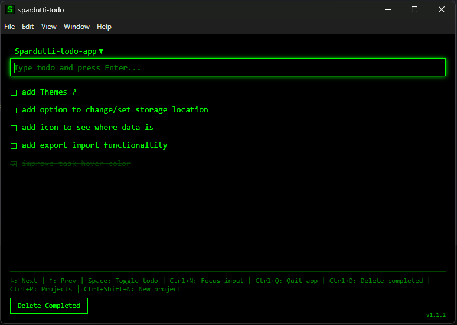

# spardutti-todo

**A minimal, lightning-fast desktop todo app for developers who value flow state.**



---

## What is spardutti-todo?

spardutti-todo is a local-first todo application built for speed and simplicity. Designed with a terminal aesthetic and keyboard-first workflow, it helps you capture tasks in under 2 seconds without breaking your concentration.

**Perfect for:**
- Developers who maintain deep focus while coding
- Anyone who needs ultra-fast task capture
- Users who prefer keyboard-driven workflows
- People who want local control over their data

---

## Key Features

### ⚡ Lightning Fast
- Launch to task entry in under 2 seconds
- Instant task creation with Enter
- Zero perceived lag on all actions
- No animations slowing you down

### 🎯 Keyboard-First
- All actions accessible via keyboard shortcuts
- Arrow key navigation through tasks
- Single-key commands for common actions
- Mouse support for convenience (fully optional)

### 🖥️ Terminal Aesthetic
- Matrix green on black theme
- Monospace font (Consolas)
- Minimal, distraction-free interface
- Professional tool, zero bloat

### 💾 Local & Private
- All data stored locally on your PC
- No cloud, no accounts, no internet required
- Human-readable storage format
- Full control over your data

### 📋 Project Management
- Organize todos by project
- Quick project switching
- Project-based filtering
- Keep work and personal tasks separate

---

## How It Works

### Quick Start
1. **Launch the app** - From your Start menu or desktop
2. **Type your task** - Input is auto-focused and ready
3. **Press Enter** - Task saved instantly
4. **Alt-Tab out** - Back to work

That's it. Under 2 seconds, total.


---

## Core Workflow

### Creating Tasks
- Input field is always ready
- Type your task and press **Enter**
- Field clears automatically for rapid-fire entry
- Add multiple tasks in quick succession

### Managing Tasks
- **Toggle complete/incomplete**: Click checkbox or press **Space**
- **Navigate tasks**: Use arrow keys (↑/↓)
- **Bulk delete**: Press **Ctrl+D** to remove all completed tasks
- **Switch projects**: Use project dropdown or shortcuts


### Keyboard Shortcuts

| Shortcut | Action |
|----------|--------|
| **Enter** | Save task (in input) or toggle (on task) |
| **Space** | Toggle task complete/incomplete |
| **↑ / ↓** | Navigate up/down through tasks |
| **Ctrl+D** | Delete all completed tasks (with confirmation) |
| **Ctrl+N** | Focus input field from anywhere |
| **Ctrl+Q** | Quit application |
| **Esc** | Close app or cancel action |
| **Tab** | Cycle through input → tasks → input |

---

## Installation

### Windows

**Option 1: Installer (Recommended)**
1. Download `spardutti-todo-Setup-{version}.exe` from [Releases](https://github.com/spardutti/spardutti-todo/releases)
2. Run the installer
3. Launch from Start menu or desktop shortcut

**Option 2: Portable (ZIP)**
1. Download `spardutti-todo-win32-x64-{version}.zip` from [Releases](https://github.com/spardutti/spardutti-todo/releases)
2. Extract to your preferred location
3. Run `spardutti-todo.exe`

### Linux

**Option 1: AppImage**
1. Download `spardutti-todo-{version}.AppImage` from [Releases](https://github.com/spardutti/spardutti-todo/releases)
2. Make it executable: `chmod +x spardutti-todo-*.AppImage`
3. Run: `./spardutti-todo-*.AppImage`

**Option 2: DEB Package (Debian/Ubuntu)**
```bash
# Download the .deb file from Releases
sudo dpkg -i spardutti-todo_{version}_amd64.deb
```

**Option 3: RPM Package (Fedora/RHEL)**
```bash
# Download the .rpm file from Releases
sudo rpm -i spardutti-todo-{version}.x86_64.rpm
```

---

## Where Your Data Lives

All todos are stored locally on your computer:

**Windows:**
```
C:\Users\{YourUsername}\AppData\Roaming\spardutti-todo\todos.json
```

**Linux:**
```
~/.config/spardutti-todo/todos.json
```

**Data Format:** JSON (human-readable, easy to backup/restore manually)

**Backup:** Simply copy the `todos.json` file to backup your tasks

---

## System Requirements

- **Windows:** Windows 10 or later (64-bit)
- **Linux:** Most modern distributions (64-bit)
- **Disk Space:** ~100MB
- **RAM:** Minimal (< 100MB typical usage)
- **Internet:** Not required (fully offline)

---

## Philosophy

spardutti-todo is built on these principles:

1. **Speed over features** - The 2-second task capture is sacred
2. **Keyboard-first** - Mouse is optional, never required
3. **Local control** - Your data stays on your machine
4. **Zero configuration** - Works perfectly out of the box
5. **Invisible until needed** - Alt-tab in, capture task, alt-tab out

This isn't a "pretty app." It's a professional tool that gets out of your way and lets you work.

---

## Tips & Tricks

### Rapid Task Capture
Press Enter repeatedly to add multiple tasks without re-focusing:
```
[Type task] → Enter → [Type task] → Enter → [Type task] → Enter
```
Input stays focused the entire time.

### Bulk Task Completion
Navigate with arrow keys and toggle with Space for fast bulk completion:
```
↓ → Space → ↓ → Space → ↓ → Space
```

### Project Organization
Create projects for different contexts:
- Personal
- Work
- Side Projects
- Shopping List
- Ideas

Switch between them instantly with the project dropdown.

---

## Updates

spardutti-todo checks for updates automatically and notifies you when a new version is available. Updates are downloaded in the background and installed on next launch.

**Manual update check:** Settings → Check for Updates

---

## Contributing

Found a bug or have a feature request? [Open an issue](https://github.com/spardutti/spardutti-todo/issues) on GitHub.

This is a personal project, but contributions are welcome.

---

## License

MIT License - See [LICENSE](./LICENSE) for details

---

## Support

- **Issues:** [GitHub Issues](https://github.com/spardutti/spardutti-todo/issues)
- **Email:** luisdamian.sp@gmail.com

---

## Credits

Built by [Spardutti](https://github.com/spardutti)

Powered by Electron, TypeScript, and the BMad Method

---

**Ready to reclaim your flow state?** [Download spardutti-todo](https://github.com/spardutti/spardutti-todo/releases) and start capturing tasks in under 2 seconds.
